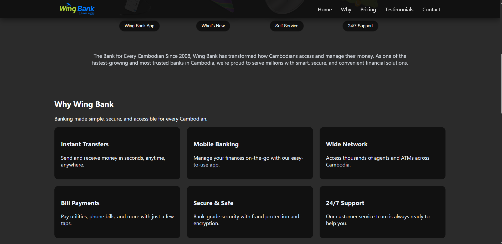
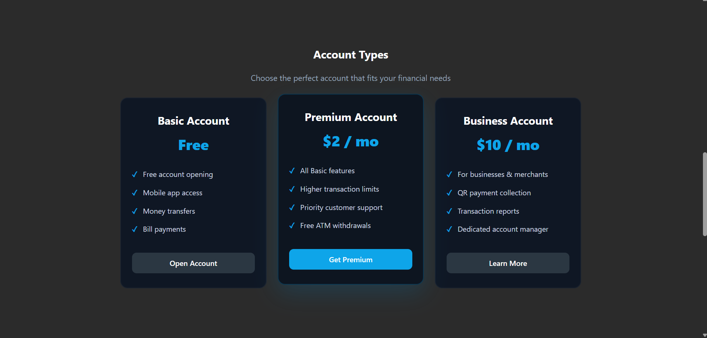
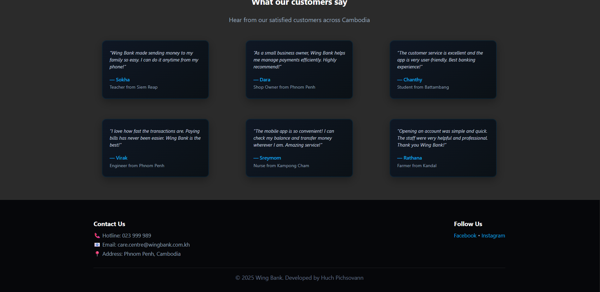
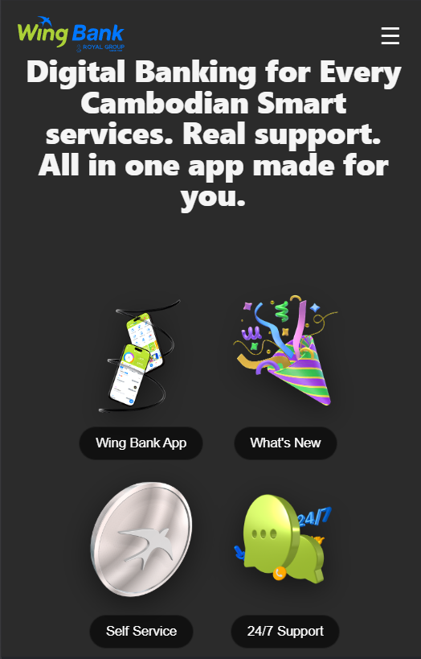
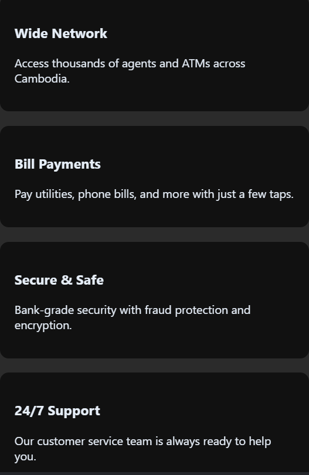
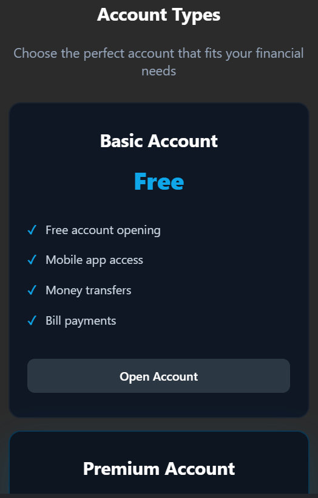
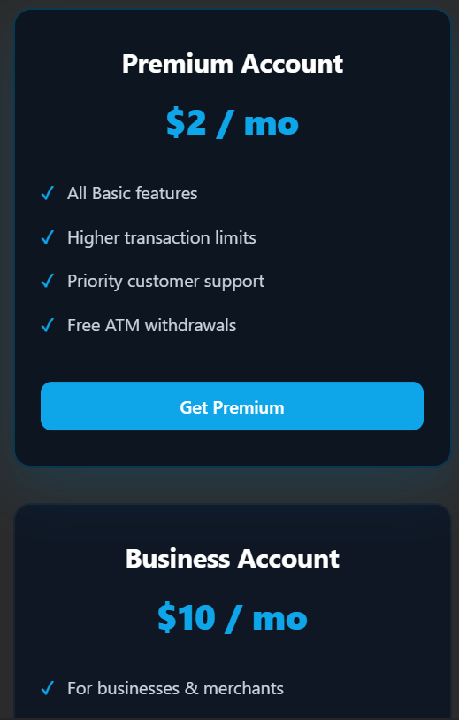
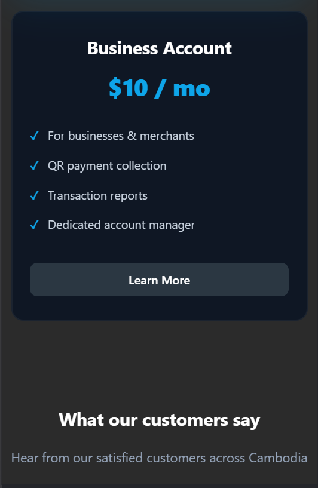
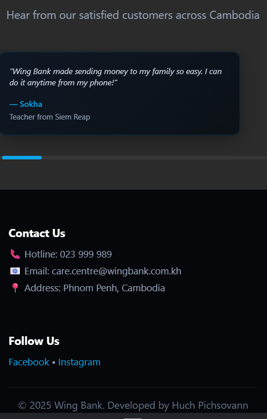

# Wing Bank - Responsive Web Page

**Created by: Huch Pichsovann**

## Live Demo

[View Live Site](https://pichsovann16.github.io/Responsive-Webpage/)

## Screenshots

### Desktop View

![Desktop Screenshot]





### Mobile View

![Mobile Screenshot]








## Project Overview

This project is a fully responsive website built with HTML, CSS, and JavaScript. It features a Wing Bank-inspired design with multiple sections including hero, features, account types, and customer testimonials.

## Implemented Features

### Navigation

- Sticky Navigation Header: Header that changes appearance on scroll
- Responsive Hamburger Menu: Mobile-friendly navigation with toggle functionality
- Smooth Scrolling: Animated navigation between sections

### Layout & Design

- Fully Responsive Design: Adapts to mobile (≤480px), tablet (481-1024px), and desktop (≥1025px)
- CSS Grid & Flexbox: Modern layout techniques for all sections
- Hero Section: Eye-catching banner with feature highlights
- Features Grid: Wing Bank App, What's New, Self Service, 24/7 Support

### Content Sections

- Why Wing Bank: 6 key features in responsive grid (Instant Transfers, Mobile Banking, Wide Network, Bill Payments, Security, Support)
- Account Types: 3 pricing tiers (Basic, Premium, Business) with hover effects
- Customer Testimonials: 6 testimonials in responsive grid layout
- Footer: Contact information and social media links

### Interactions

- Hover Effects: Interactive cards and buttons
- Mobile Menu Toggle: Smooth open/close animations
- Accessibility: ARIA labels and semantic HTML

## 📁 Project Structure

```
Creatingfirstpage/
├── assets/
│   └── images/
│       ├── 24hour-support.png
│       ├── self-service.png
│       ├── whatis-new.png
│       ├── wing-app.png
│       └── favicon.svg
└──     screenshots/
│       ├── desktop-1.png
│       ├── desktop-2.png
│       ├── desktop-3.png
│       ├── desktop-4.png
│       └── mobile-1.png
├       ├── mobile-2.png
│       ├── mobile-3.png
│       ├── mobile-4.png
│       ├── mobile-5.png
│       └── mobile-6.png
        ├── mobile-7.png
├── css/
│   └── style.css
├── index.html
├── script.js
├── .hintrc
└── README.md
```

## Technologies Used

- HTML5 - Semantic markup with accessibility features (ARIA labels)
- CSS3 - Modern styling with Flexbox and Grid layouts, custom animations
- JavaScript (ES6) - Interactive functionality and DOM manipulation

## Credits

### Images

- Wing Bank Logo: Wing Bank official webpage
- Feature Icons (24hour-support.png, self-service.png, whatis-new.png, wing-app.png favicon.svg): Wing Bank official webpage

### Fonts

- Inter: Primary font (System font fallback: system-ui, Segoe UI, Roboto, Arial)

### Design Inspiration

- Wing Bank official website and branding guidelines
- Modern banking UI/UX best practices

## How to Run Locally

### Direct File Opening

1. Download or clone this repository:
   ```bash
   git clone https://github.com/Pichsovann16/Responsive-Webpage
   ```
2. Navigate to the project folder:
   ```bash
   cd Creatingfirstpage
   ```
3. Open `index.html` directly in your web browser

## Responsive Breakpoints

The design adapts to different screen sizes:

- Mobile: ≤ 480px (hamburger menu)
- Tablet: 481px - 1024px
- Desktop: ≥ 1025px

## Key Sections

### Hero Section

- Main headline with call-to-action
- Feature highlights with icons
- Descriptive text about Wing Bank

### Why Section

- Grid layout showcasing 6 key features
- Uses CSS Grid for responsive card layout

### Pricing Section

- Three pricing tiers displayed with Flexbox
- "Popular" plan highlighted
- Clear feature lists and CTAs

### Testimonials Section

- Responsive grid layout displaying 6 customer testimonials
- Hover effects on testimonial cards
- Real customer stories from different professions and cities

## JavaScript Features

- Hamburger Menu Toggle - Mobile navigation functionality
- Scroll Detection - Adds styling to header on scroll
- Smooth Scroll - Animated scrolling to anchor links
- Auto Menu Close - Mobile menu closes after clicking a link

## Browser Support

- Chrome (latest)
- Firefox (latest)
- Safari (latest)
- Edge (latest)


## Contributing

This is a Wing Scholarship project submission. For educational purposes only.

## License

This project is part of a scholarship application for Wing Bank.

## Author

**Huch Pichsovann**  
RUPP CSD Student - Wing Scholarship Application

## Contact

For questions or feedback about this project, please refer to the contact section on the website.

---

Important note: This is a demo project created as part of Module 1: Responsive Web Page for the Wing Scholarship program. I acknowledge that I have intergrated with AI tools including ChatGPT as well as Warp as assistant in helping me achieve this responsive web page for my homework in the first week of the program. For useful and creative ideas in the process, I have gone through loads of aligend and conflicting percepion on how to make this webpage happen regarding cleaner styles and shorter and equally effective excecuation of codes. Therefore, I believe that it will be a good step that I take and hopefully, it builds my foundation as a software developer at the begining of the Full-stack development course in order to equip with practical skills and experiences in the future.
